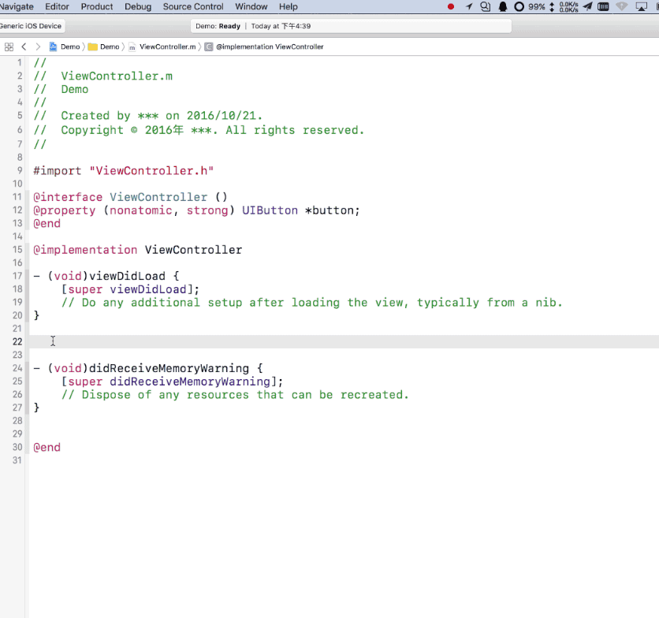

# Introduction
Auto Completion the getter of property (Xcode8 Editor Extension)
 
自动完成属性的getter方法
 
 

#Download
<a href ="https://github.com/keepyounger/AutoCompletion/blob/master/AutoCompletion.zip?raw=true"> AutoCompletion </a>  

# Support
Xcode 8 or later
# Thanks
<a href ="https://github.com/molon/MLAutoReplace"> MLAutoReplace </a>  
